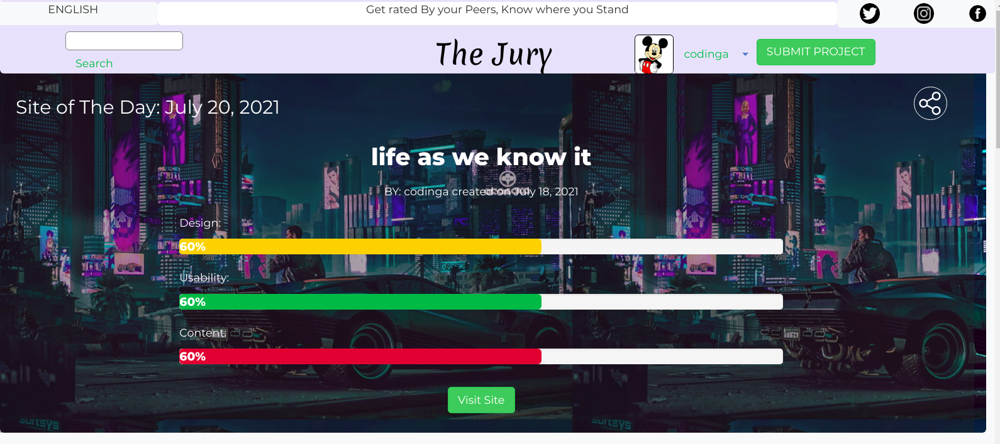
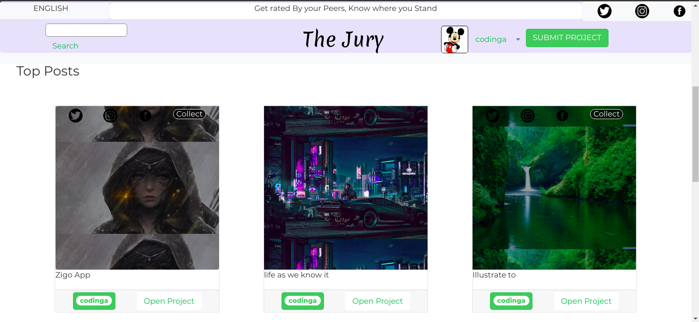
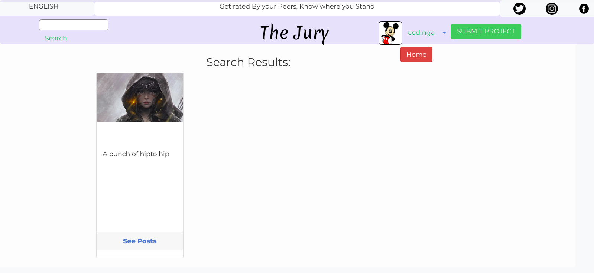
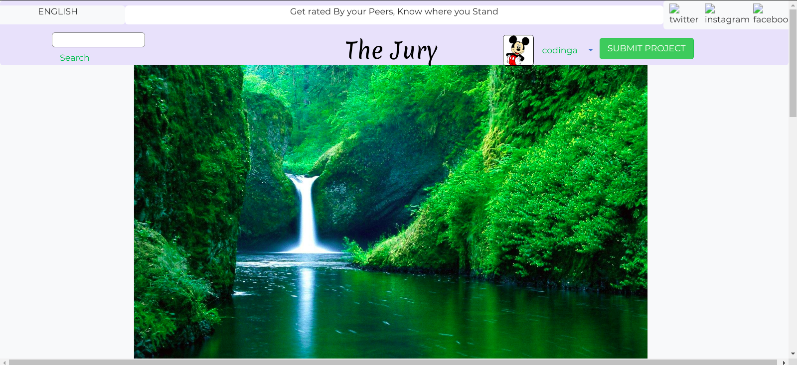
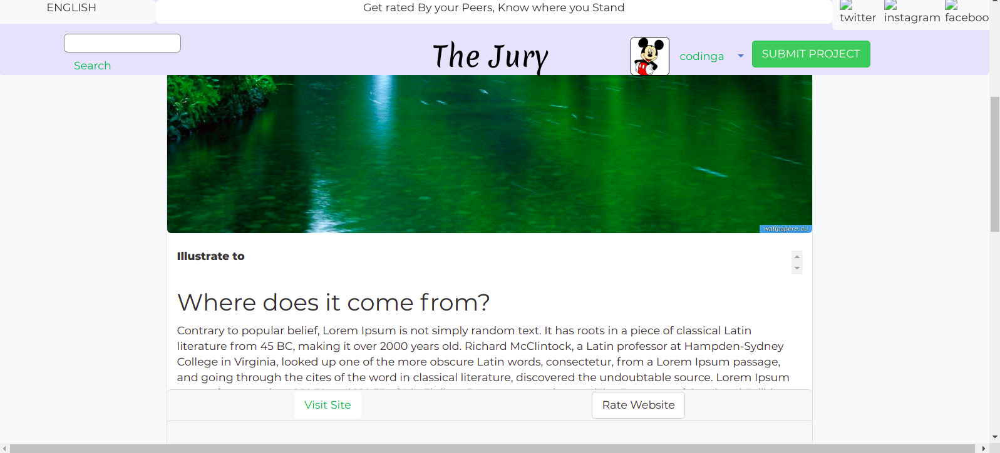
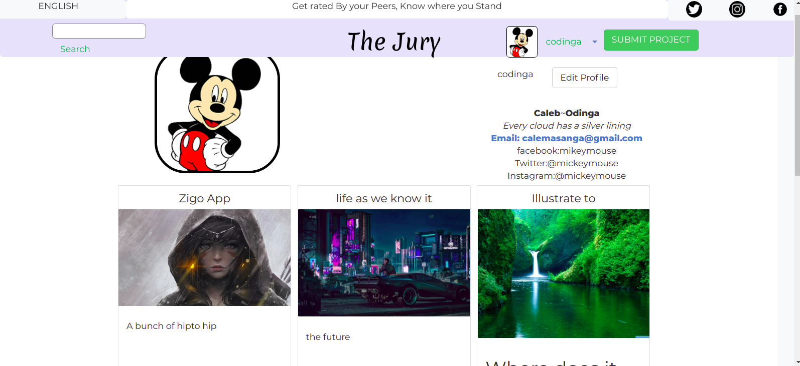
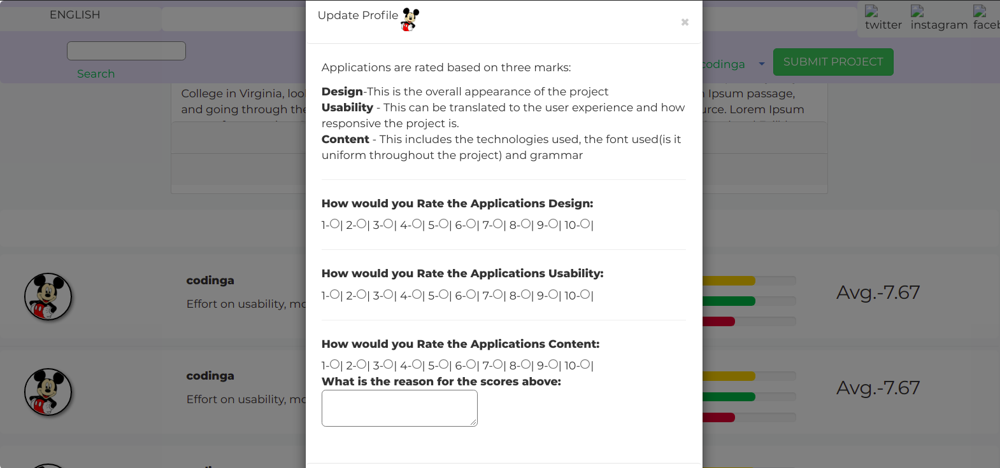
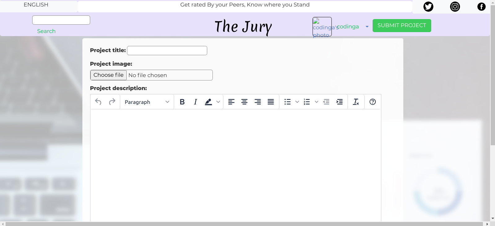
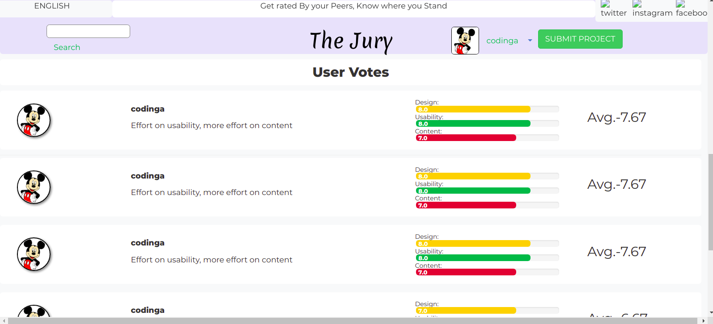

# The_Jury
This is a social website where users can upload their projects to be reviewed and rated. 
A wesite is rated in three categories, Design, Content and usability.
A user can also rate other applications uploaded to the website, giving description to why a given score waht given.
A user can also visit an uploaded application by visiting the provided link.
The application also provides api on user profiles and Projects existing in the application

# User journey.
A user visits the site. 
|_A user views projects upoaded in homepage. 
  |_A user Logs in 
    |__A user visits profile page and Add/updates profile details. 
    |_A user views a project. 
      |-A user rates a project and can gve feedback or comment 
      |-A user visits an external link of the project. 
      |-A user views other users/ votes and ratings
    |__A user searches for a project 
  |-A user logs out and is redirected to homepage 

# Features to add
Jury qualification. A user get more confidence in voting depending on their history in the website

# Output
A user selects a an project and can see its details.

A searches for projects

A users updates bio and profile page

A user uses the api links provided to get data

# Homepage

# Project posts

# Search results page

# Single Project

# user profile

# Rating form

# Submit Project form

# Users' Votes

# Installation
For correct version requirements installation, check the requirements.txt

Have Python installed in you machine.- the version used for this project is 3.8.5

install pip

install and activate virtual environment

install flask in the virtual environment < version used flask1.0.2 >

Use git, Github and any editor or IDE to see the codes and the rendered frontend.

The execution is done in terminal. Either computer Terminal or IDE terminal

# Usage
Ensure you have Python installed in your machine. Clone this github repository, git pull to your local machine and code away.

# Contributing
Pull requests are welcome. For major changes, please open an issue first to discuss what you would like to change.

Please make sure to update tests as appropriate.

# Website's link
This aplication is hosted heroku. Website Link is https://

# API Links

User Profiles Link --
Projects Link --

# License
This Website uses MIT LICENSE. For more Read License.

Copyright (c) 2021 Caleb Odinga